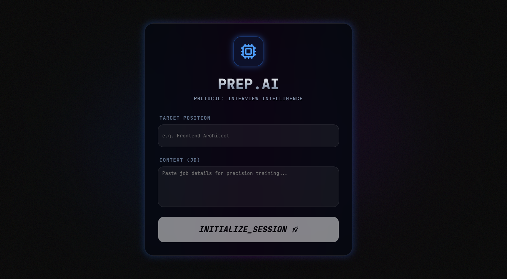
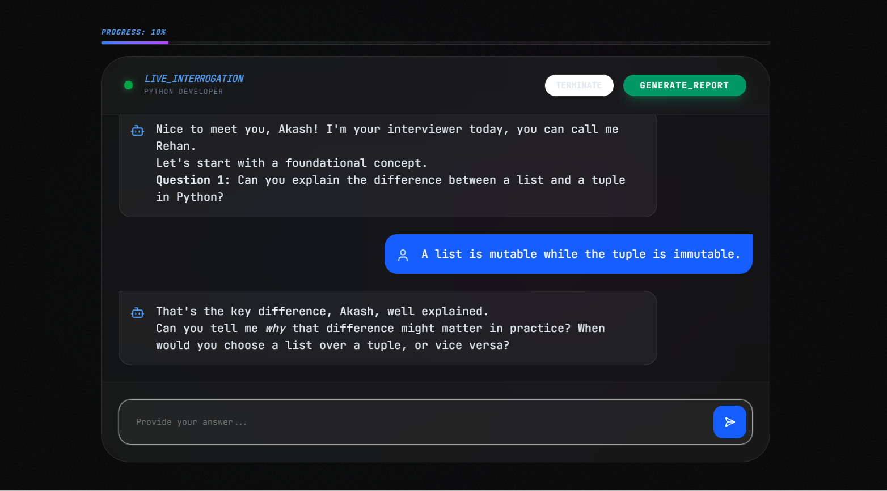
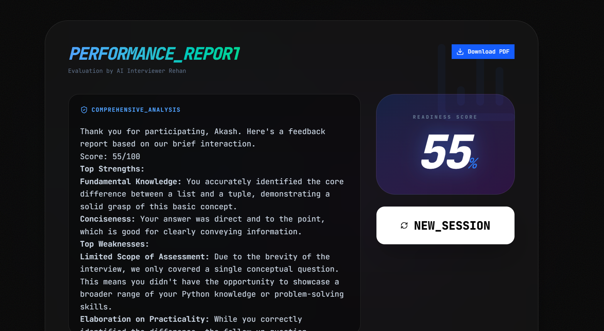
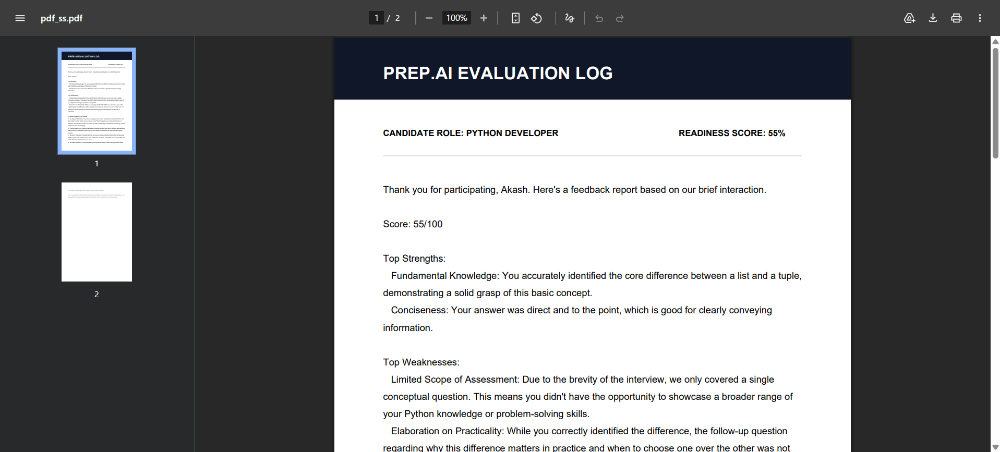

# Prep.AI 🤖 — The Neural Interview Engine

[](https://prep-ai-psi-gilt.vercel.app/)
[](https://github.com/rehan1608/interview-mate)

> Built for the **Thinkly Labs Software Engineering Assignment**. Prep.AI moves beyond generic chatbots to provide a high-fidelity, high-stakes mock interview experience.

---

## 🌟 Vision & Product Thinking

Interview anxiety is a major hurdle for developers. Most AI "interview tools" are just simple chat wrappers that fail to create the necessary "high-pressure" atmosphere of a real technical screening.

**Prep.AI** was engineered to solve this by focusing on **immersion** and **structure**.

I built this project not just to showcase coding ability, but to demonstrate "Fullstack Thinking", integrating sleek frontend design with robust API logic and purposeful generative AI to solve a real user problem.

---

## 🖼️ Product Walkthrough

### 1. Adaptive Setup
The journey begins with context. Candidates define their target role and paste a Job Description. This allows the Neural Engine to specialize its questions, ensuring precision training.



### 2. Live Interrogation with "Rehan"
The interface shifts to a "High-Stakes" mode. We introduce **Rehan**, an elite AI Interrogator. The conversation flow follows a strict, professional protocol: **Warm-up -> Candidate Intro -> Technical Deep Dive**.

- **UX Detail:** Sleek, hover-active custom scrollbars and a real-time logical progress bar keep the user focused.



### 3. The Performance Report
Once the interview is complete, the engine compiles a comprehensive evaluation. This isn't just a summary; it's a dynamic dashboard featuring:

- A generated **Readiness Score (1-100)**.
- **Detailed Evaluation Logs** parsed from the AI's deep analysis.
- **Official PDF Export:** A professional, multi-page PDF report is generated for offline review, featuring custom auto-pagination.



### 4. Report PDF
On the feedback page, I've integrated a button to download the pdf of the report, generated by the AI:



---

## 🛠️ Core Engineering & Tech Stack

This project was built from scratch using modern, industry-standard technologies focused on performance, type-safety, and maintainability.

### The Stack
- **Framework:** Next.js 15 (App Router)
- **AI Brain:** Google Gemini 2.5 Flash API
- **Styling:** Tailwind CSS + Shadcn/UI
- **Animations:** Framer Motion
- **Language:** TypeScript
- **PDF Generation:** jsPDF
- **Markdown Handling:** ReactMarkdown

### Key Engineering Challenges Solved
1.  **Context-Aware System Prompting:** Engineered a robust `systemInstruction` prompt to force the AI to maintain the "Rehan" persona, follow the 3-stage flow, and parse the user's JD for specialized questions.
2.  **Graceful API Failure:** Free tiers have limits. I implemented a custom error-handling layer that detects Google's `429` (Too Many Requests) response and notifies the user with a themed "System Alert" instead of crashing the UI.
3.  **PDF Auto-Pagination:** `jsPDF` can be tricky with long text. I wrote a recursive script that calculates Y-coordinates, automatically adds new pages, and cleans raw AI Markdown symbols (stars, hashtags) to produce a polished, corporate-ready document.
4.  **Logical Progress Tracking:** The progress bar is decoupled from simple message count. It uses state-based logic to track actual **technical question engagement**, providing a truthful representation of the interview state.

---

## 💻 Local Development & Testing

Want to audit the code or test "Rehan" locally? Here’s how to get up and running.

### Prerequisites
- Node.js 18+ installed.
- A Google Gemini API Key (get a free one [here](https://aistudio.google.com/)).

### Step 1: Clone the Repository
```bash
git clone https://github.com/rehan1608/interview-mate
cd interview-mate
```
### Step 2: Install Dependencies
```bash
npm install
# OR
yarn install
```

### Step 3: Configure Environment Variables
Create a file named ```.env.local``` in the root directory and add your API key:
```bash
GOOGLE_GENERATIVE_AI_API_KEY=your_actual_gemini_api_key_here
```
(Note: .env.local is already in .gitignore and will never be pushed to GitHub.)

### Step 4: Run the Development Server
```bash
npm run dev
# OR
yarn dev
```
Open http://localhost:3000 in your browser.

---

### How to Test
- Run the app locally.
- Start a session for a role like "Python Developer."
- Test the Persona: Reply "No" to the first question ("Are you ready?") to see Rehan's warm response.
- Test the Evaluation: Complete 5-6 technical exchanges and click "FINISH & ANALYZE" to review the dashboard and download the PDF.
